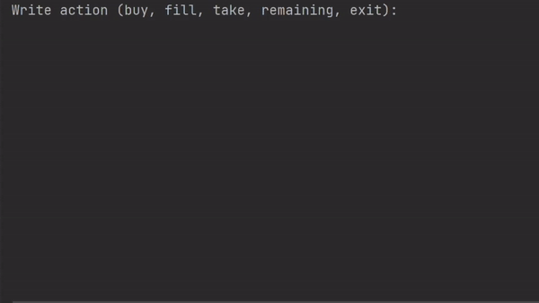

# CoffeeMachine
Java interface to simulate coffee vending machine, runs in an IDE console environment.

## Task Description

Let's simulate a coffee machine. It has a limited supply of water, milk, coffee beans, and disposable cups. Also, it counts how much money it gets for selling coffee.

The coffee machine has several options: first, it needs to be able to sell coffee. It can make different varieties of coffee: espresso, latte, and cappuccino. Of course, each variety requires a different amount of supplies, except that all of them require only one disposable cup. Second, the coffee machine should be able to get replenished by a special worker. Third, another special worker should be able to take money from the coffee machine.

The program repeatedly asks what the user wants to do. If the user writes "buy" then they must choose one of three varieties of coffee that the coffee machine can make: espresso, latte, or cappuccino. If the user writes "fill", the program should ask them how much water, milk, coffee, and how many disposable cups they want to add to the coffee machine. If the user writes "take" the program should give them all the money that it earned from selling coffee. If the user wants to switch off the coffee machine, he should type "exit". Then the program should terminate. Also, when the user types "remaining", the program should output all the resources that the coffee machine has.

Also, do not forget that you can be out of resources for making coffee. If the coffee machine doesn’t have enough resources to make coffee, the program should output a message that says it can't make a cup of coffee and state what is missing.

And the last improvement to the program -if the user types "buy" to buy a cup of coffee and then changes his mind, he should be able to type "back" to return into the main cycle.

Remember, that:

- At the start, the coffee machine has $550, 400 ml of water, 540 ml of milk, 120 g of coffee beans, and 9 disposable cups.
- For the espresso, the coffee machine needs 250 ml of water and 16 g of coffee beans. It costs $4.
- For the latte, the coffee machine needs 350 ml of water, 75 ml of milk, and 20 g of coffee beans. It costs $7.
- And for the cappuccino, the coffee machine needs 200 ml of water, 100 ml of milk, and 12 g of coffee. It costs $6.

## Demo


## Example
Your coffee machine should have the same initial resources as in the example (400 ml of water, 540 ml of milk, 120 g of coffee beans, 9 disposable cups, $550 in cash).
The symbol `>` represents the user input. Note that it's not part of the input.

```
Write action (buy, fill, take, remaining, exit): 
> remaining

The coffee machine has:
400 ml of water
540 ml of milk
120 g of coffee beans
9 disposable cups
$550 of money

Write action (buy, fill, take, remaining, exit): 
> buy

What do you want to buy? 1 - espresso, 2 - latte, 3 - cappuccino, back - to main menu: 
> 2
I have enough resources, making you a coffee!

Write action (buy, fill, take, remaining, exit): 
> remaining

The coffee machine has:
50 ml of water
465 ml of milk
100 g of coffee beans
8 disposable cups
$557 of money

Write action (buy, fill, take, remaining, exit): 
> buy

What do you want to buy? 1 - espresso, 2 - latte, 3 - cappuccino, back - to main menu: 
> 2
Sorry, not enough water!

Write action (buy, fill, take, remaining, exit): 
> fill

Write how many ml of water you want to add: 
> 1000
Write how many ml of milk you want to add: 
> 0
Write how many grams of coffee beans you want to add: 
> 0
Write how many disposable cups of coffee you want to add: 
> 0

Write action (buy, fill, take, remaining, exit): 
> remaining

The coffee machine has:
1050 ml of water
465 ml of milk
100 g of coffee beans
8 disposable cups
$557 of money

Write action (buy, fill, take, remaining, exit): 
> buy

What do you want to buy? 1 - espresso, 2 - latte, 3 - cappuccino, back - to main menu: 
> 2
I have enough resources, making you a coffee!

Write action (buy, fill, take, remaining, exit): 
> remaining

The coffee machine has:
700 ml of water
390 ml of milk
80 g of coffee beans
7 disposable cups
$564 of money

Write action (buy, fill, take, remaining, exit): 
> take

I gave you $564

Write action (buy, fill, take, remaining, exit): 
> remaining

The coffee machine has:
700 ml of water
390 ml of milk
80 g of coffee beans
7 disposable cups
$0 of money

Write action (buy, fill, take, remaining, exit): 
> exit
```
